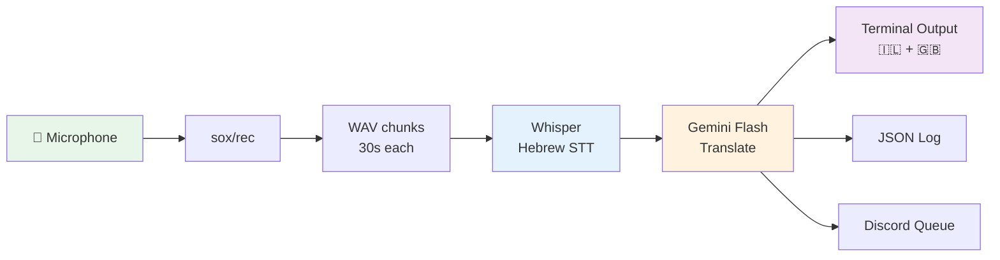
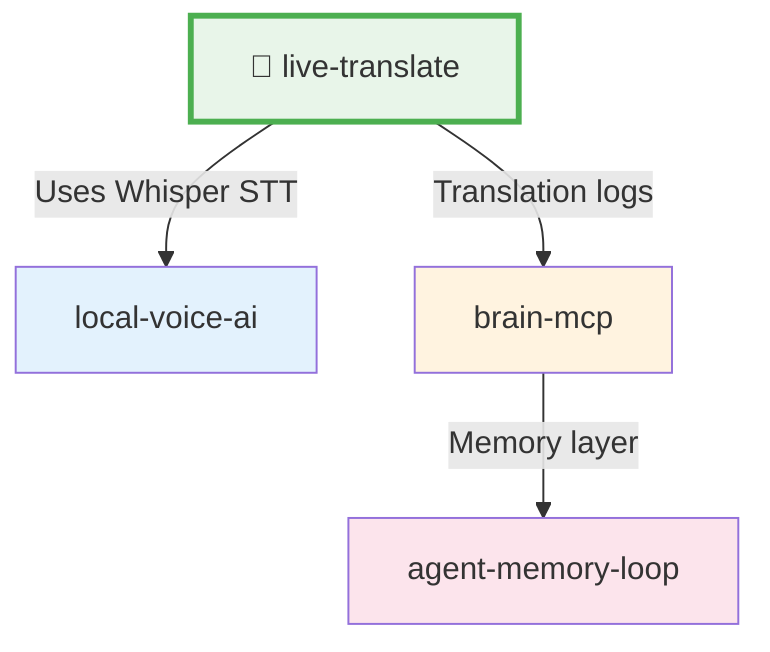

# 🎤 live-translate

**Real-time Hebrew→English translation from your Mac microphone. One script, zero config.**

<p align="center">
  
</p>

<p align="center"><i>⬆️ Auto-playing preview — <a href="https://github.com/user-attachments/assets/aa4ca180-d989-413a-afac-100fda0d0b7d">click here for full video with audio</a></i></p>


https://github.com/user-attachments/assets/aa4ca180-d989-413a-afac-100fda0d0b7d


> Used at a live tech meetup. 188 lines of bash. Records, transcribes, translates — no gaps.

---

## What This Does

Records Hebrew speech from your microphone in continuous chunks, transcribes with [Whisper](https://github.com/openai/whisper) locally, translates via Gemini Flash through [OpenRouter](https://openrouter.ai), and outputs side-by-side Hebrew + English to your terminal — plus a JSON log and optional Discord queue.

**The key insight:** Most live translation tools *pause recording while transcribing*. This one records chunk N+1 **while processing chunk N** in the background. Zero gaps. Continuous audio capture.

### Example Output

```
🎤 Hebrew → English Live Translation
Chunk: 30s | Model: google/gemini-2.5-flash-lite | Parallel record/process
JSON log: /tmp/live-translate/translations.json
────────────────────────────────────────

🇮🇱 אז מה שאנחנו עושים פה זה בעצם לוקחים את כל ה-API הזה ומריצים אותו בתוך Docker
🇬🇧 So what we're doing here is essentially taking this entire API and running it inside Docker

🇮🇱 והדבר המגניב הוא שזה רץ לוקאלי, אין צורך בשום שרת ענן
🇬🇧 And the cool thing is that this runs locally, no cloud server needed

🇮🇱 אנחנו משתמשים ב-ONNX runtime בשביל ה-inference כי זה הרבה יותר מהיר מ-PyTorch
🇬🇧 We're using ONNX runtime for inference because it's much faster than PyTorch
```

---

## How It Works



### The Parallel Pipeline

```
Time ──────────────────────────────────────────────►

Chunk 1:  [████ RECORD ████][████ PROCESS ████]
Chunk 2:                     [████ RECORD ████][████ PROCESS ████]
Chunk 3:                                        [████ RECORD ████][████ PROCESS ████]

                              ▲ No gap here — recording starts immediately
```

While chunk N is being transcribed and translated (5-10s), chunk N+1 is already recording. You never miss a word.

---

## Installation

### 1. Install sox (audio recording)

```bash
brew install sox
```

### 2. Install Whisper (local speech-to-text)

```bash
pip install openai-whisper
```

### 3. Get an OpenRouter API key

Sign up at [openrouter.ai](https://openrouter.ai) and grab your API key.

```bash
export OPENROUTER_API_KEY="sk-or-..."
```

### 4. Get the script

```bash
git clone https://github.com/mordechaipotash/live-translate.git
cd live-translate
chmod +x live-translate
```

---

## Usage

### Basic (just run it)

```bash
./live-translate
```

### With Discord output

```bash
./live-translate --discord 1234567890123456789
```

Translation pairs are written to `/tmp/live-translate/discord_queue.txt` for your bot to pick up.

### Custom chunk size

```bash
./live-translate --chunk 20
```

Shorter chunks = lower latency, but Whisper works better with more context. 30s is the sweet spot.

### With custom Whisper path

```bash
WHISPER_CMD=/path/to/whisper ./live-translate
```

### With a different translation model

```bash
TRANSLATE_MODEL=google/gemini-2.5-flash ./live-translate
```

---

## Configuration

| Variable | Default | Description |
|----------|---------|-------------|
| `OPENROUTER_API_KEY` | *(required)* | Your OpenRouter API key |
| `CHUNK_SECS` | `30` | Recording chunk duration in seconds |
| `WHISPER_CMD` | `whisper` | Path to Whisper binary |
| `TRANSLATE_MODEL` | `google/gemini-2.5-flash-lite` | OpenRouter model for translation |
| `DISCORD_CHANNEL` | *(none)* | Discord channel ID (or use `--discord`) |

The script also checks `.env` and `~/.env` for `OPENROUTER_API_KEY` if not in your environment.

---

## Why Parallel?

Most live translation tools follow a serial pipeline:

```
❌ Serial:   [RECORD]──[TRANSCRIBE]──[TRANSLATE]──[RECORD]──[TRANSCRIBE]──...
                                                   ▲ Gap! Audio lost here
```

This script runs recording and processing in parallel:

```
✅ Parallel: [RECORD 1]──[RECORD 2]──────[RECORD 3]──────...
                     └──[PROCESS 1]──┘└──[PROCESS 2]──┘
                        No gaps. Ever.
```

Recording never stops. Processing happens in the background via bash `&`. Simple, effective, zero dependencies beyond sox and Whisper.

---

## Adapting for Other Languages

The script is built for Hebrew→English, but adapting it takes two changes:

1. **Change the Whisper language flag** — find `--language he` and change to your [language code](https://github.com/openai/whisper#available-models-and-languages)
2. **Update the translation prompt** — find the `translate_text` function and adjust the system prompt

For example, Japanese→English:
```bash
# In the script, change:
--language ja
# And update the prompt to mention Japanese instead of Hebrew
```

---

## Cost

| Component | Cost | Where |
|-----------|------|-------|
| Whisper STT | **Free** | Runs locally on your Mac |
| Gemini Flash Lite | **~$0.001/chunk** | Via OpenRouter API |
| sox/rec | **Free** | Local audio recording |

A typical 1-hour meetup = ~120 chunks = **~$0.12 total**.

This is NOT a cloud transcription service. Whisper runs entirely on your machine. Only the translation step hits an API, and Gemini Flash Lite is absurdly cheap.

---

## Output Files

All output goes to `/tmp/live-translate/`:

| File | Content |
|------|---------|
| `translations.json` | Array of `{hebrew, english, time}` objects |
| `discord_queue.txt` | Formatted pairs for Discord bot pickup (if `--discord` set) |

### JSON format

```json
[
  {
    "hebrew": "אז מה שאנחנו עושים פה זה בעצם לוקחים את כל ה-API",
    "english": "So what we're doing here is essentially taking this entire API",
    "time": "19:42:15"
  }
]
```

---

## Requirements

- **macOS** (uses `rec` from sox for microphone access)
- **Python 3.8+** (for Whisper)
- **~1.5GB disk** (Whisper turbo model, downloaded on first run)
- **OpenRouter API key** (free tier available)
- **jq** (usually pre-installed on macOS, or `brew install jq`)

---

## Ecosystem

`live-translate` is part of a suite of AI tools:

| Repo | What |
|------|------|
| **[live-translate](https://github.com/mordechaipotash/live-translate)** | ← You are here. Real-time Hebrew→English translation |
| [local-voice-ai](https://github.com/mordechaipotash/local-voice-ai) | Local voice AI pipeline (Whisper + TTS on Apple Silicon) |
| [brain-mcp](https://github.com/mordechaipotash/brain-mcp) | MCP server for querying 370K+ conversations as a cognitive prosthetic |
| [agent-memory-loop](https://github.com/mordechaipotash/agent-memory-loop) | Persistent memory layer for AI agents |
| [mordenews](https://github.com/mordechaipotash/mordenews) | AI-curated news aggregator |
| [x-search](https://github.com/mordechaipotash/x-search) | Real-time X/Twitter search via Grok |
| [qinbot](https://github.com/mordechaipotash/qinbot) | Multi-platform AI chatbot framework |

### How They Connect



`live-translate` shares the same Whisper STT pipeline as [local-voice-ai](https://github.com/mordechaipotash/local-voice-ai), and its translation output can feed into [brain-mcp](https://github.com/mordechaipotash/brain-mcp) for searchable knowledge capture.

---

## License

MIT — see [LICENSE](LICENSE)

---

*Built by [Mordechai Potash](https://github.com/mordechaipotash). Used at the Clawders meetup for real-time Hebrew→English translation of technical presentations.*


---

## How This Was Built

Built by [Steve [AI]](https://github.com/mordechaipotash), Mordechai Potash's agent. 100% machine execution, 100% human accountability.

> The conductor takes the bow AND the blame. [How We Work →](https://github.com/mordechaipotash/mordechaipotash/blob/main/HOW-WE-WORK.md)
